## 计算机毕业设计之Python+Vue.js+Flask+Scrapy电影爬虫可视化系统 电影推荐系统  协同过滤算法电影推荐系统 大数据毕业设计

## 要求
### 源码有偿一套(论文 PPT 源码+sql脚本)
### 

### 加好友前帮忙start一下，并备注github有偿获取源码
### 我的QQ号是2877135669 或者 1679232425
### 加qq好友说明（被部分  网友整得心力交瘁）：
    1.加好友务必按照格式备注
    2.避免浪费各自的时间

## 开发技术
协同过滤算法、机器学习、vue.js、echarts、Flask、Python、MySQL

## 创新点
协同过滤推荐算法、爬虫、数据可视化

## 补充说明
1. 两种Python协同过滤推荐算法集成 (ItemCF推荐算法 和 UserCF 推荐算法)
2.专业美工整体设计的细腻的酷黑主题，前后端分离一体化系统（爬虫→MySQL→Flask→Vue）；
3. 实现影片库搜索，多种Echarts图形分析、jieba分析；
4.完全移动端自适应，自动可以适配H5移动端；
5.实现的分析图：交互式时间轴、世界地图、词云、散点图、多种折线图、面积图、大数据图、动画柱状图、饼图、水滴图等。

# 运行截图

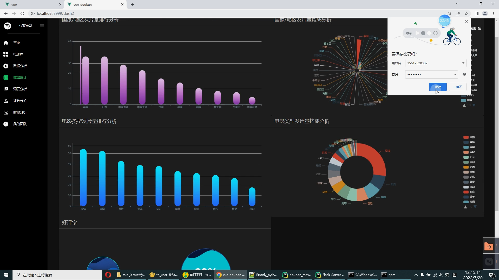

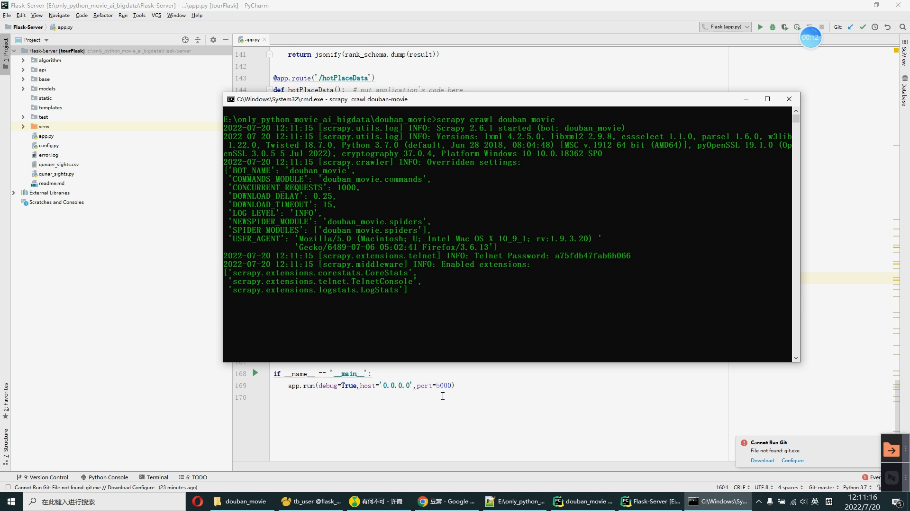

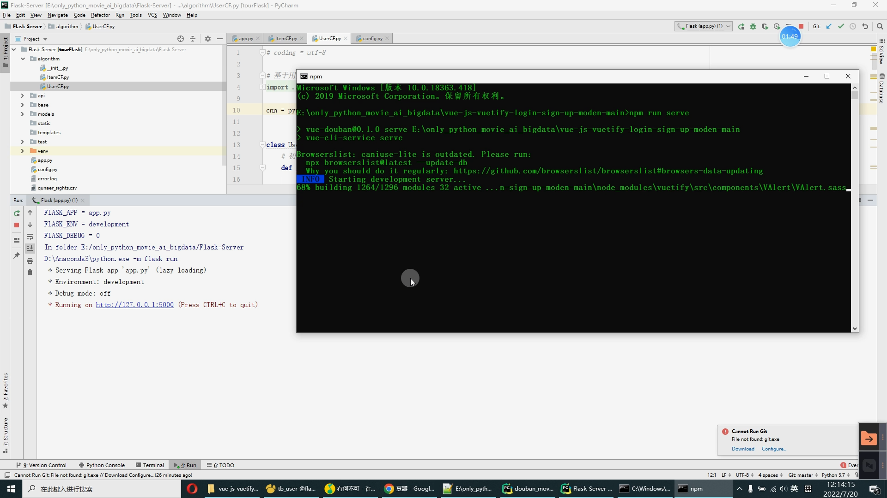

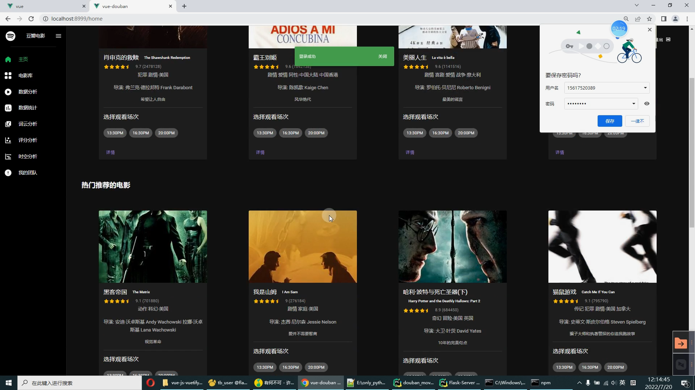

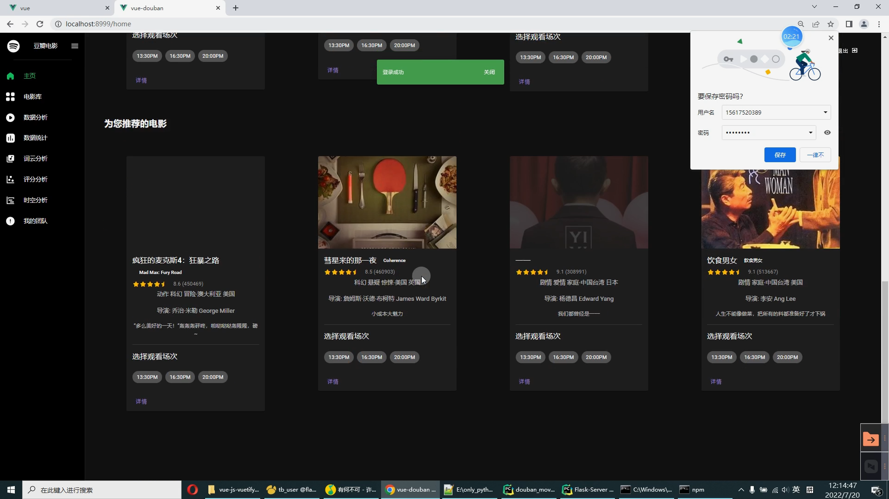

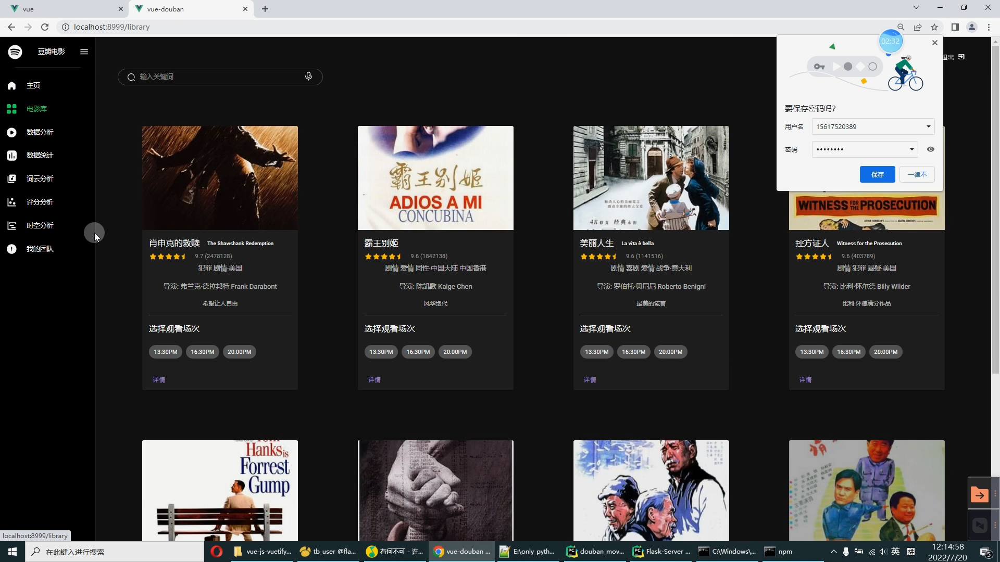

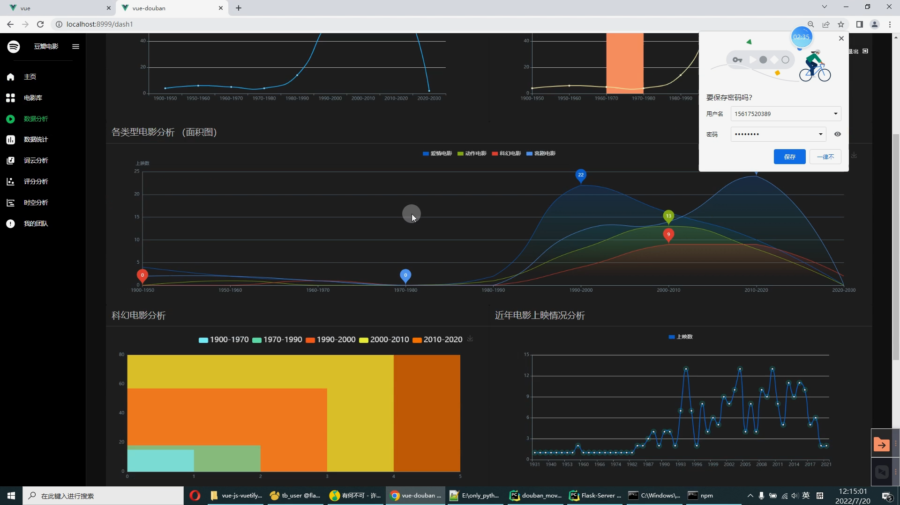

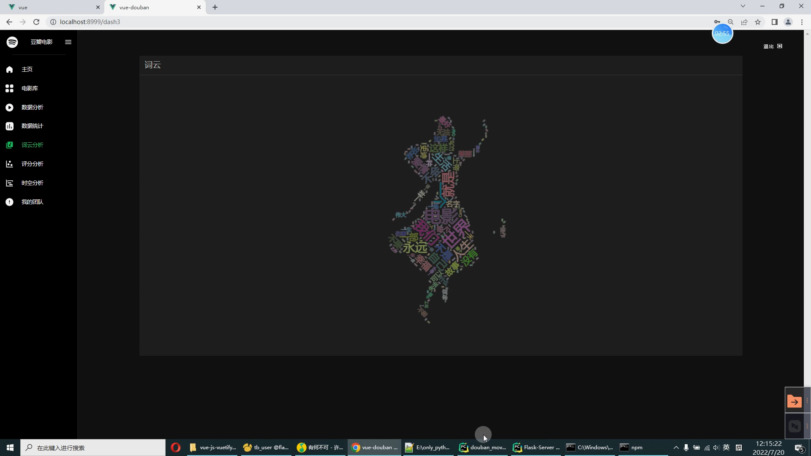

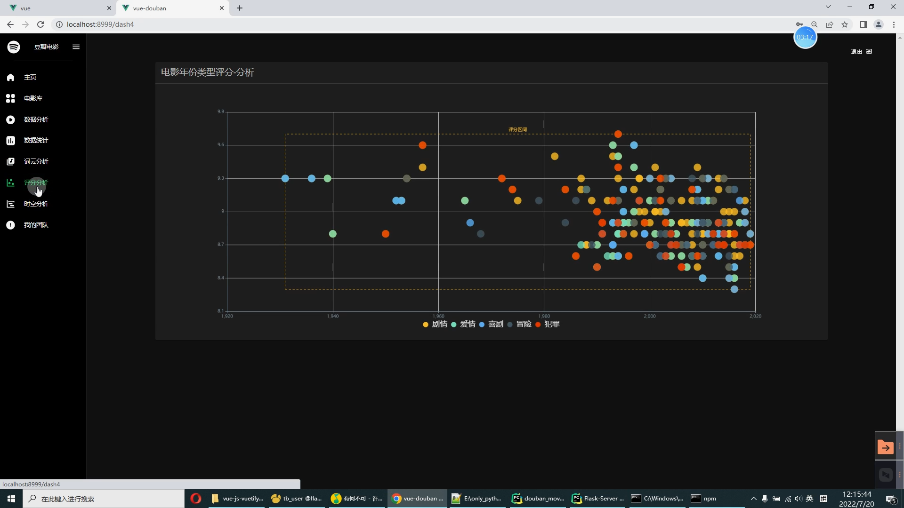

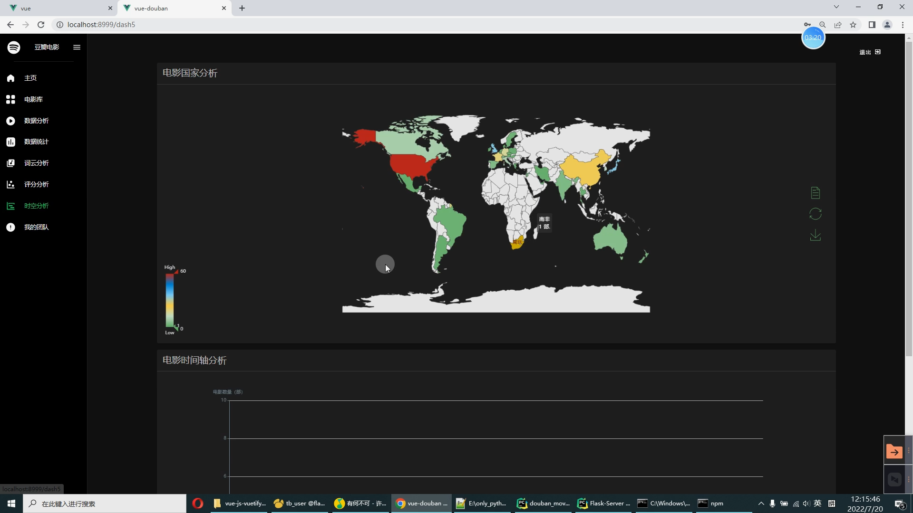

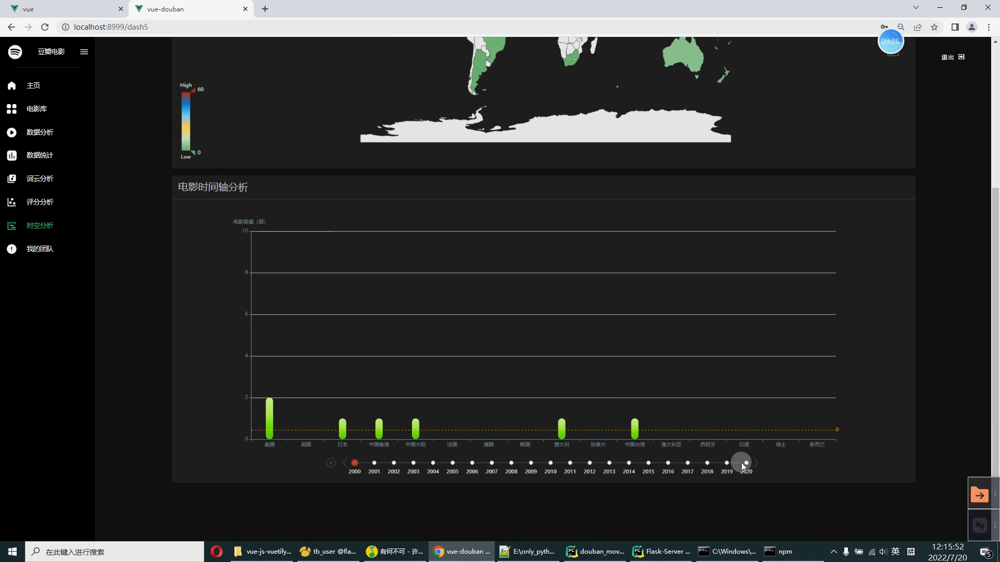

